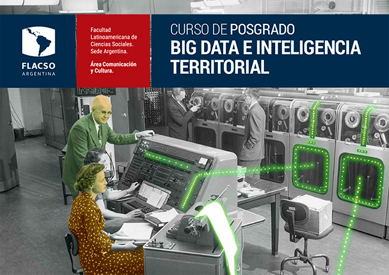

[](https://www.flacso.org.ar/formacion-academica/big-data-e-inteligencia-territorial/)

# [Germán Rosati](gefero.github.io)

# Presentación
El objetivo de este curso es brindar una primera aproximación a algunos conceptos fundamentales de Machine Learning: hiperparámetros, sesgo-varianza, flujo de trabajo, error de generalización, serán algunos de los conceptos a trabajar.


# Contenidos y materiales

- __Unidad 1.__ Modelos de aprendizaje automático: fundamentos conceptuales, diferencias con el enfoque estadístico tradicional.

- __Unidad 2.__ Problemas de clasificación y regresión.
Aprendizaje supervisado y no supervisado. Modelos simples y ensambles de modelos.

- __Unidad 3.__ Unidad Consideraciones para el diseño de modelos de aprendizaje automático con datos espaciales


# Clase 1. 
- [Explicación y práctica - Notebook](/clase_1/notebook/intro_caret_notebook.nb.html)
- [Explicación y práctica - RCode](/clase_1/scripts/intro_caret_script.R)
- [Slides Intro ML - pdf](/clase_1/slides/Clase1a.pdf)
- [Slides Over-Under fitting - pdf](/clase_1/slides/Clase1b.pdf)

Pueden descargarse la totalidad de los materiales del repositorio para trabajar en un único archivo .zip

- [](clase_1.zip)


# Clase 2. 
- [Explicación y práctica guiada - Notebook](/clase_2/notebook/cart_notebook.nb.html)
- [Explicación y práctica guiada - RCode](/clase_2/scripts/cart_script.R)
- [Slides CART - pdf](/clase_2/slides/CARTS.pdf)
- [Slides Bagging/RF - pdf](/clase_2/slides/Ensamble_Bagging_RF.pdf)

Pueden descargarse la totalidad de los materiales del repositorio para trabajar en un único archivo .zip

- [](clase_2.zip)


# Clase 3. 
- [Intuición Gradient Boosting Machine - Notebook](/clase_3/notebook/boosting_intuicion_notebook.nb.html)
- [Intuición Gradient Boosting Machine - RCode](/clase_3/scripts/boosting_intuicion_script.R)
- [Consignas práctica independiente - Notebook](/clase_3/notebook/practica.nb.html)
- [Soluciones práctica independiente - Notebook](/clase_3/notebook/solution_practica.nb.html)
- [Slides Boosting - pdf](/clase_3/slides/Boosting.pdf)

Pueden descargarse la totalidad de los materiales del repositorio para trabajar en un único archivo .zip

- [](clase_3.zip)


# Clase 4. 
- [Explicación y práctica guiada - Clasificación - Notebook](/clase_3/notebook/rf_boosting_notebook.nb.html)
- [Explicación y práctica guiada - Clasificación - RCode](/clase_3/scripts/rf_boosting_script.R)
- [Interpretable ML - Notebook](/clase_3/notebook/interpretable_ml_notebook.Rmd)
- [Interpretable ML - RCode](/clase_3/notebook/interpretable_ml_script.R)


# Librerías a utilizar
El taller se desarrollará en R y se hará un uso extensivo de las siguientes librerías:

- `tidyverse`
- `caret`

Pueden instalarse utilizando las instrucciones:

```{r}
install.packages('tidyverse')  
install.packages('caret') 
```


# Bibliografía y sitios de consulta

- [James, G., Witten, D., Hastie, T. y Tibshirani, R. (2015), _Introduction to Statistical Learning_, Berlin: Springer.](http://faculty.marshall.usc.edu/gareth-james/ISL/)

- [Kuhn, M. (s/f), _The `caret` package](http://topepo.github.io/caret/index.html)
