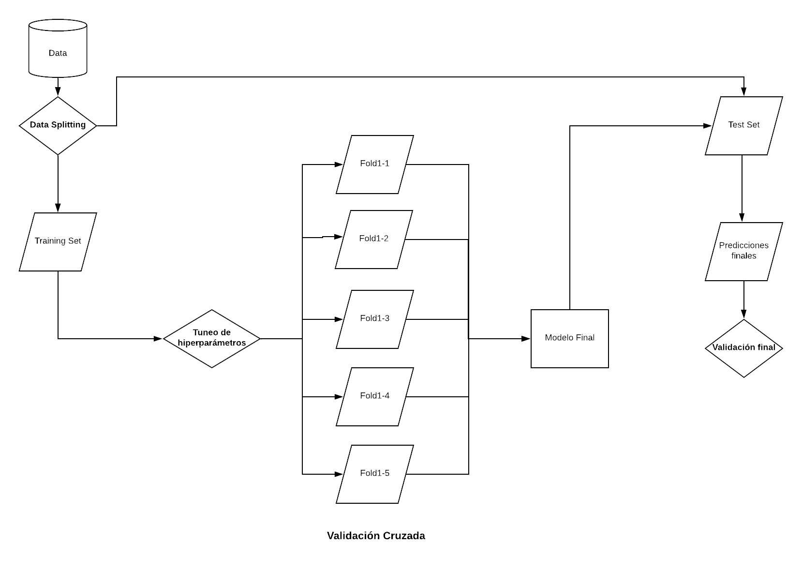

## Objetivos

- Introducir algunos conceptos básicos del enfoque del Aprendizaje Automático
- Mostrar el framework `caret` para automatizar algunas tareas del entrenamiento

## El problema

Nuestro problema central es, poder realizar un modelo que logre prededir  los ingresos de la ocupación principal (`p21`) en la [Encuesta Permanente de Hogares](https://www.indec.gob.ar/indec/web/Institucional-Indec-BasesDeDatos) del segundo trimestre del 2015.

Puede notarse que se trata de un problema bastante amigable, por así decirlo, al enfoque de Machine Learning:

- tenemos un conjunto de casos en los que desconocemos nuestra variable $Y$ 
- queremos predecirla
- queremos evaluar qué tan bien funciona el modelo que usemos

## Pipeline de trabajo para entrenar modelos de Machine Learning con `caret`




### 0. Preprocesar los datos

Lo primero que tenemos que hacer es importar las librerías con las que vamos a trabajar:

```{r message=FALSE, warning=FALSE}
library(caret)
library(tidyverse)
```

Luego, cargamos los datos y formateamos un poco algunas etiquetas:

```{r}
load('../data/EPH_2015_II.RData')

data$pp03i<-factor(data$pp03i, labels=c('1-SI', '2-No', '9-NS'))


data$intensi<-factor(data$intensi, labels=c('1-Sub_dem', '2-SO_no_dem', 
                                            '3-Ocup.pleno', '4-Sobreoc',
                                            '5-No trabajo', '9-NS'))

data$pp07a<-factor(data$pp07a, labels=c('0-NC',
                                        '1-Menos de un mes',
                                        '2-1 a 3 meses',
                                        '3-3 a 6 meses',
                                        '4-6 a 12 meses',
                                        '5-12 a 60 meses',
                                        '6-Más de 60 meses',
                                        '9-NS'))
```

Vale aclarar que `caret` tiene unas cuantas funciones para realizar el preprocesamiento. Pueden consultar su uso [acá](http://topepo.github.io/caret/pre-processing.html).

Existen en nuestro dataset, datos que no contestaron ingresos. Son datos perdidos y tenemos que resolver qué hacer con ellos. En este ejemplo vamos a eliminarlos. Esta opción está lejos de ser la óptima, pero la seleccionamos para simplificar el problema y la exposición. 

En caso de que les interese el tema de imputación de missing data, les dejo dos artículos con aplicaciones de Machine Learning al problema (y sobre el mismo dataset).


- [Revista Saberes](https://www.saberes.fcecon.unr.edu.ar/index.php/revista/article/view/132)
- [Congreso ASET 2019](https://aset.org.ar/2019/ponencias/20_Rosati.pdf) pueden encontrar 

Tenemos codificados como `imp_inglab1==1` a los que no contestaron ingresos en la ocupación principal, los filtramos, entonces...

```{r}
df <- data %>%
        filter(imp_inglab1==0) %>%
        select(-imp_inglab1) %>%
        mutate(p21 = case_when(
                        p21==0 ~ 100,
                        TRUE ~ p21))

```


#### Algunas cosas a notar

Por un lado, vemos que encadenamos unas cuántas operaciones mediante un operador (`%>%`) llamado `pipe`. El pipe es un símbolo que relaciona dos entidades. Dicho en forma más simple, el pipe de R está en familia con otros operadores más convencionales, como +, - o /. Y al igual que los otros operadores, entrega un resultado en base a los operandos que recibe. 

Ahora bien… ¿Para qué sirve? En resumidas cuentas, hace que el código necesario para realizar una serie de operaciones de transformación de datos sea mucho más simple de escribir y de interpretar.

Repasemos la primer secuencia

- filtramos los datos con algún perdido (`%>% filter(imp_inglab==1)`)
- eliminamos la columna identificadora de los casos perdidos (`select(-imp_inglab)`)


### 1. Split o Estimando el error de generalización

Nos interesa testear nuestro(s) modelo(s), es decir, poder evaluar qué tan bien funcionan. Pero la trampa aquí es que queremos testearlo en datos que no hayan sido usados para entrenar el modelo. Queremos estimar lo que se llama _error de generalización_. Esto nos introduce a un problema que excede este tutorial pero que se vincula al [_bias-variace tradeoff_](http://scott.fortmann-roe.com/docs/BiasVariance.html). 

Para simplificar digamos si evaluamos nuestro modelo sobre los mismos datos sobre los que lo entrenamos existen "incentivos" para generar un modelo innecesariamente complejo. Pero, al mismo tiempo, no queremos que nuestro modelo sea demasiado simple. En líneas generales, los modelos demasiado complejos sufren de _overfitting_ y los demasiado simples sufren de _underfitting_.

Tenemos muchas formas de estimar el error de generalización (train-test split, cross validation, bootstrap). Usaremos dos estrategias de validación diferentes. Primero, vamos a dividir en dos pedazos el dataset:

- sobre nuestro _train set_ entrenaremos el modelo
- sobre el _test set_ lo validaremos.


Vamos a generar los índices mediante `caret`. 

Primero, fijamos la semilla aleatoria (para asegurarnos la posibilidad de replicabilidad)


```{r}
set.seed(957)
```

Y luego generamos los índices para el split:

```{r}
train_index <- createDataPartition(y = df$p21,
                                   p=0.7,
                                   list=FALSE)
```

Aquí usamos tres argumentos:

- `y = df_train$p21`, es el vector de resultados. En nuestro caso, los ingresos de la ocupación principal
- `p=0.7`, es la proporción del dataset original que formará parte del training set.
- `list=FALSE`, le decimos que lo que nos devuelva sea un vector y no una lista.

Luego, generamos el split:

```{r}
df_train <- df[train_index,]
df_test <- df[-train_index,]
```

Ahora bien, como sabemos, parte del proceso de entrenamiento es el proceso de    [optimización de los hiperparámetros](https://en.wikipedia.org/wiki/Hyperparameter_optimization). Es por ello que tenemos que diseñar una segunda estrategia de validación: en este caso, será de [_cross-validation_](https://en.wikipedia.org/wiki/Cross-validation_(statistics)).

Podemos usar la función `createFolds()` para generar los índices. 


```{r}
cv_index <- createFolds(y = df_train$p21,
                        k=5,
                        list=TRUE,
                        returnTrain=TRUE)
```


Aquí usamos tres argumentos:

- `y = df_train$p21`, igual que en caso anterior
- `k=5`, es la cantidad de grupos para realizar la validación cruzada
- `returnTrain=TRUE`, le decimos que lo que nos devuelva, sean las posiciones de correspondientes a los datos de entrenamiento en cada posición


#### 1.1 Poniendo todo el diseño junto: train_control.

Finalmente, especificamos el diseño de remuestreo mediante la función `trainControl`:

```{r}
fitControl <- trainControl(
        index=cv_index,
        method="cv",
        number=5)
```

`fitControl`, entonces, será el objeto que contenga nuestro diseño para realizar el tuneo de los hiperparámetros...


## Entrenando modelos (`train()`)

Tenemos listo nuestro esquema de remuestreo. Podemos pasar a entrenar nuestro primer modelo. Para ello haremos uso extensivo de la función `train()`. La misma puede usarse para 

- evaluar mediante remuestreo el efecto de cada hiperparámetro en la performance
- elegir el modelo "óptimo" (la mejor combinación de parámetros) 
- estimar la performance del modelo

Primero, debemos elegir el modelo para entrenar. Actualmente, `caret` dispone de 238 modelos disponibles. Puede consultarse [la seccion correspondiente ](http://topepo.github.io/caret/available-models.html) del sitio para mayores detalles. También, llegado el caso, podrían usarse modelos ad-hoc definidos por el usuario.

Comencemos con un modelo simple, pero efectivo: una regresión lineal. Como podrán ver en el sitio, cada modelo puede ser estimado por diferentes implementaciones en diferentes paquetes. Nosotros usaremos la implementación de r-base `lm()` por simplicidad.

Entrenemos una regresión lineal con caret: comencemos con un modelo simple, sexo y edad.

```{r}        
lm_p21 <- train(p21 ~ ch04 + ch06, data = df_train, 
                 method = "lm", 
                 trControl = fitControl)

lm_p21
```

Veamos los coeficientes...

```{r}
lm_p21$finalModel
```

Veamos, ahora, un modelo más complejo:

```{r warning=FALSE}
lm_p21_b <- train(p21 ~ ., data = df_train, 
                 method = "lm", 
                 trControl = fitControl)
```

```{r}
lm_p21_b
```


Los modelos de machine learning tienen ciertos parámetros que deben ser seleccionados antes de estimar el modelo, propiamente dicho: se llaman [__hiperparámetros__](https://en.wikipedia.org/wiki/Hyperparameter_(machine_learning)). Si bien la regresión lineal no es estrictamente hablando un modelo de machine learning (aunque muches lo consideran como tal) sí tiene algo que se le parece bastante a un hiperparámetro... la existencia de un intercepto. En efecto, nosotros estimamos un modelo de la siguiente forma:

$y_{i} = \beta_{0} + \sum_{p=1}^P \beta_{p} X_{i}$

Pero podríamos haber estimado

$y_{i} = \sum_{p=1}^P \beta_{p} X_{i}$

Más allá de la discusión sobre si la regresión es ML o no, lo interesante es ver que la decisión sobre el entrenamiento de un modelo lineal con intercepto o no, es una decisión que se toma antes de entrenar el modelo propiamente dicho.

Ahora bien, vamos a buscar otro modelo con mejores hiperparámetros para tunear: un árbol de decisión. Si bien, no vamos a profundizar en sus detalles técnicos, podemos revisar su implementación en caret.


### 3. Tuneando hiperparámetros...

Vamos a entrenar un [árbol de decisión](https://en.wikipedia.org/wiki/Decision_tree_learning). Podemos entonces, comparar la performance de diferentes combinaciones de hiperparámetros. Para ello, primero tenemos que construir la grilla de hiperparámetros.  

```{r}
grid <- expand.grid(maxdepth=c(1, 2, 4, 8, 16))
```

El parámatro `maxdepth` permite definir la "profundidad" del árbol, es decir, cuántos niveles tiene. A mayor profundidad, mayor complejidad del modelo. Queda claro que antes de construir el árbol, tendría que definir qué tan profundo debería ser el mismo, por ello se trata de un _hiperparámetro_.

Y volvemos a entrenar el modelo:

```{r warning=FALSE}
cart_p21 <- train(p21 ~ . , 
                 data = df_train, 
                 method = "rpart2", 
                 trControl = fitControl,
                 tuneGrid =grid)

cart_p21
```

En este caso, hemos realizado una búsqueda exhaustiva, es decir, hemos recorrido la totalidad de la grilla de hiperparámetros y hemos seleccionado el mejor modelo. Como puede verse, esto ha llevado un tiempo de cómputo nada despreciable. 

Es por ello que existe una segunda opción...


### Random search

En este caso, en lugar de realizar una búsqueda exhaustiva, podemos reducir notablemente el tiempo de cómputo buscando en una muestra aleatoria de la grilla de hiperparámetros. Para esto, solamente debemos agregar el parámetro `search` y setearlo en `'random'` en el objeto `fitControl`:


```{r warning=TRUE}
fitControl_rand <- trainControl(
        index=cv_index, 
        method="cv",
        number=5,
        search = 'random')
```


Y volvemos a entrenar el modelo:


```{r}
cart_p21_rand <- train(p21 ~ ., data = df_train, 
                 method = "rpart2", 
                 trControl = fitControl_rand,
                 tuneLength = 2)

cart_p21_rand
```


## Seleccionando el mejor modelo

Una vez finalizado el proceso de tunning de los hiperparámetros, podemos proceder a elegir cuál es el mejor modelo. 

```{r}
cart_p21
```


Podemos persistir  el modelo en disco (si quisiéramos):

```{r}
saveRDS(cart_p21, '../models/p21_cart.rds')
```


Podemos realizar un plot del efecto de los hiperparámetros:

```{r}
ggplot(cart_p21)
```


Existen diferentes métricas de selección, las cuales deben ser definidas en la función `train`, usando el argumento `selectionFunction` que puede tomar tres valores:

- `"best"`: se selecciona el mejor modelo con la menor métrica de error (la que usaremos aquí)
- `"oneSE"`: utiliza la regla de "un desvío estándar" de [Breiman et al (1986)](https://books.google.com.ar/books/about/Classification_and_Regression_Trees.html?id=JwQx-WOmSyQC&redir_esc=y&hl=es)
- `"tolerance`; que busca seleccionar el modelo menos complejo dentro de un margen de tolerancia respecto al mejor modelo

También podrían definirse métodos ad-hoc para esta selección.


```{r}
cart_p21$bestTune
```


¿Cuál es el mejor modelo (en términos absolutos)?


## Realizando la evaluación final

Una vez que hemos seleccionado el mejor modelo, podemos pasar a la evaluación final y persistimos el modelo para reutilizarlo en otras aplicaciones. Vemos entonces que el modelo seleccionado performa con un $R^2=0.34$ y un $RMSE=4770$. Solamente nos quedaría re-entrenar el modelo final (el mejor) sobre la totalidad del dataset de entrenamiento:

```{r}
cart_p21
```

Lo interesante es que de forma automática Í`caret` selecciona el emjor modelo y lo entrena sobre la totalidad del dataset.

### 4. Obteniendo las predicciones finales

El último paso es obtener las predicciones finales (es decir, nuestras imputaciones). De forma interesante, podemos utilizar lso datos perdidos como datos "nuevos" y desconocidos.

Es decir que, finalmente, habremos realizado una imputación de datos perdidos. Para ello, llamamos a la función `predict()` que toma como primer argumento al objeto que contiene al modelo final y como segundo argumento el data.frame con los datos a imputar:


```{r}
y_preds_cart <- predict(cart_p21, df_test)
```

Testeemos, entonces, el modelo final, calculemos el error final:

```{r}
sqrt(mean((y_preds_cart - df_test$p21)**2))
```

### 5. Pasando en limpio

`caret` es un paquete que trata de "unificar" las múltiples librerías en R para modelado predictivo. Permite estandarizar bastante el flujo de trabajo en sus diferentes etapas. De hecho, podemos diseñar un flujo de trabajo simple en unas pocas líneas de código:

```{r,  eval=FALSE, echo=TRUE}
## Spliting
train_index <- createDataPartition(y = df$p21,
                                   p=0.7,
                                   list=FALSE)

## Estrategia de tuneo
fitControl <- trainControl(
        index=cv_index,
        method="cv",
        number=5)

## Grilla de hiperparámetros
grid <- expand.grid(maxdepth=c(1, 2, 4, 8, 16))


## Training
cart_p21 <- train(p21 ~ . , 
                 data = df_train, 
                 method = "rpart2", 
                 trControl = fitControl,
                 tuneGrid =grid)

## Validación final
y_preds_cart <- predict(cart_p21, df_test)
sqrt(mean((y_preds_cart - df_test$p21)**2))
        
```
